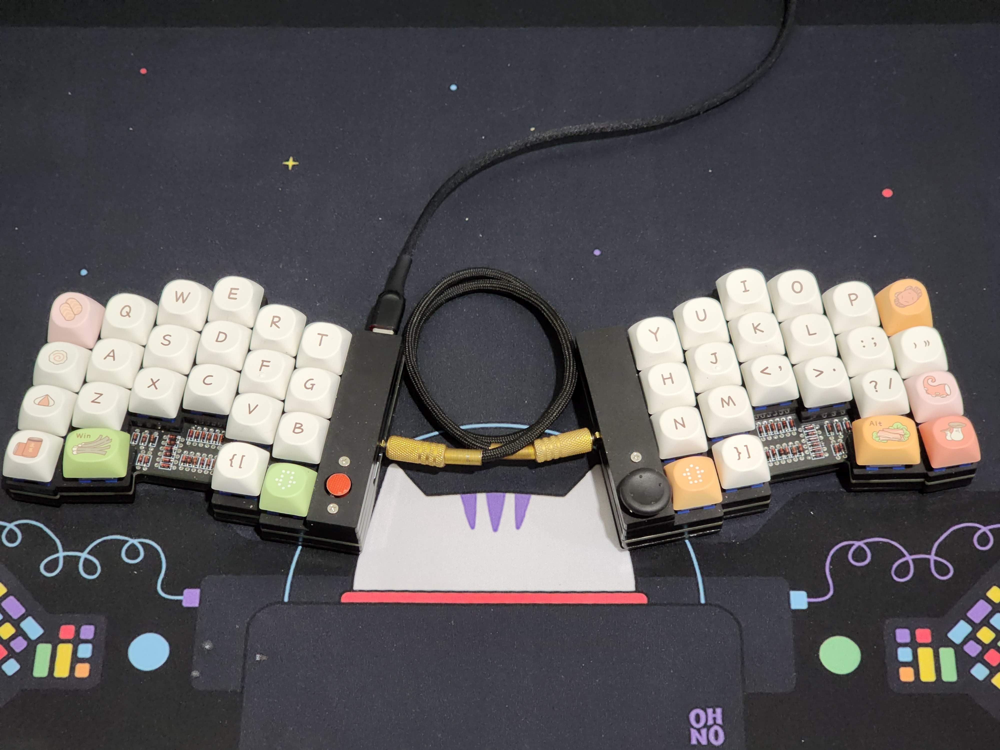

# DO42



This is a 42 key keyboard with a trackpoint on the left half and a dpad on the right half.

- Keyboard Maintainer: BrokenAxe
- Hardware Supported: Pro Micro or clone
- Hardware Availability: [do42 with Trackpoint]()

Make example for this keyboard:

```
make do42/rev1:default
```

Flashing example for this keyboard:

```
make do42/rev1:default:flash
```

## Bootloader
Enable bootloader by shorting the RESET and GROUND pin on the MCU.

Otherwise once the firmware is flashed, this can be done by pressing the key mapped to `QK_BOOT`.

## EE Hands
Flash with `avrdude-split-left` and `avrdude-split-right` to make EE hands work.

```
# Example
qmk flash -kb do42 -km brokenaxe -bl avrdude-split-left
qmk flash -kb do42 -km brokenaxe -bl avrdude-split-right
```

